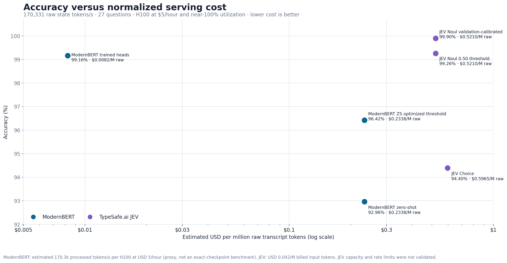

# System1 classifier comparisons for customer-care transcripts

This repository represents an independent comparison of open encoder classifiers, TypeSafe.ai JEV, and frontier LLMs on the same synthetic customer-care transcript classification task.

**Author: Mark Austin**

The benchmark contains 1,000 synthetic conversations, each labeled for 27 binary customer-care attributes. The fixed split is 700 training, 150 validation, and 150 locked test conversations. All quality numbers below are calculated only on the locked test set: 4,050 binary decisions.

> This is a controlled synthetic benchmark, not a claim of production accuracy. The conversations use explicit, template-driven evidence and do not represent the ambiguity, distribution shift, or annotation disagreement of live calls.

## Key results


The principal findings are:

- JEV Noul with validation-refined criteria and validation-selected thresholds reached 99.90% accuracy and 99.81% micro F1, four errors across 4,050 decisions.
- GPT-5.6 Sol produced the highest measured result: 99.93% accuracy and 99.86% F1, three errors.
- GPT-5.6 Luna reached 99.75% accuracy and 99.53% F1.
- A frozen ModernBERT encoder with 27 supervised logistic heads reached 99.16% accuracy and 98.41% F1.
- Per-label threshold calibration improved unchanged zero-shot ModernBERT from 92.96% to 96.42% accuracy without training new weights.
- DeBERTa-v3-large-zeroshot-v2.0-c did not beat ModernBERT zero-shot on this dataset and was approximately 2.47 times slower on the same CPU path.

## Accuracy versus normalized serving cost



This scenario fixes the incoming workload at **170,331 raw transcript tokens per second**, or about 759 average benchmark transcripts per second. The deployment uses NVIDIA H100s at the requested **$5/GPU-hour** and assumes near-100% utilization. Because no exact-checkpoint H100 benchmark was available, the 170,331-token/s ModernBERT-large capacity is a proxy: a public 350,000-token/s H100 observation for ModernBERT-base, scaled by the official RTX 4090 short-variable large/base throughput ratio (`52.9 / 108.7`). Rebenchmarking the actual checkpoint and serving stack is required before using these figures for procurement.

| Inference path | Input/computation shape | Normalized cost / hour | Cost / 1M raw state tokens |
|---|---|---:|---:|
| ModernBERT trained heads | State encoded once; 27 fixed heads | $5.04 | $0.0082 |
| ModernBERT zero-shot | 27 state/hypothesis pairs | $143.35 | $0.2338 |
| JEV Noul | Shared-state API billing; 27 arbitrary questions | $319.45 | $0.5210 |
| JEV Choice | Shared-state API billing; question/option criteria | $365.80 | $0.5965 |

Under these assumptions, JEV Noul costs about **2.23x** the arbitrary-question ModernBERT zero-shot path and **63.3x** the fixed-taxonomy trained-head path per raw transcript token. The trained-head comparison is not like-for-like on question flexibility: its cost advantage comes from compiling the 27 known labels into learned weights.

The GPU quantities are continuous GPU-equivalents: this assumes a large enough fleet or time-sharing system to keep capacity nearly full. It excludes redundancy, orchestration, storage, and engineering. JEV cost is extrapolated from measured billed input tokens and its published $0.042-per-million-token rate; this benchmark did not validate that the hosted service can sustain the hypothetical request rate.

Throughput sources: [official ModernBERT RTX 4090 efficiency comparison](https://huggingface.co/blog/modernbert) and [the third-party H100 ModernBERT-base deployment observation](https://www.linkedin.com/posts/michael-feil_the-latest-release-of-infinity-httpslnkdin-activity-7280971190632943616-E07N). The $5/H100-hour price is a scenario assumption, not a quoted provider price.

## What ModernBERT actually processes

Your distinction is correct for zero-shot ModernBERT, but the trained model is even more specialized than `state + N * question_size`:

| System | Approximate inference input | Arbitrary new questions? |
|---|---|---|
| ModernBERT zero-shot NLI | `sum(tokenize(state, question_i))`, approximately `N * state + sum(question_i)` | Yes |
| Trained ModernBERT heads | `tokenize(state)` once, followed by `sigmoid(W h + b)` for 27 learned heads | No |
| JEV | One state plus arbitrary typed questions in one request | Yes |

Across the locked test set, the ModernBERT tokenizer measured a 224.46-token average state. Zero-shot NLI processed 6,435.42 tokens per transcript across the 27 pairs, a **28.67x amplification**. The trained model processed about 226.46 tokens once. It does not tokenize the 27 question descriptions at inference: their meaning has been absorbed into the trained head weights. A new attribute therefore requires a new or retrained head.

## Does this prove JEV has a new architecture?

No—not from public evidence currently available. TypeSafe publicly claims a “new model architecture,” a “parallel sampler,” and RLCD training. Its API unquestionably supports arbitrary state and arbitrary typed questions, something the fixed-head ModernBERT configuration cannot do. But the public API documentation does not disclose the internal compute graph, parameter count, attention arrangement, or state-reuse mechanism.

The observed billing equation and near-flat 1-to-16-question latency establish useful external behavior, not architectural novelty. A conventional batched cross-encoder can also show nearly flat latency until the GPU batch saturates while still repeating the state internally. A dual encoder, cached state encoder, late-interaction model, or shared-state cross-attention design could also provide arbitrary questions without being a fundamentally new model family.

The defensible conclusion is: **JEV exposes a valuable arbitrary-question/shared-state product abstraction and prices it as shared state; whether its internal architecture is genuinely novel remains unverified.**

## Complete quality table


| Approach | Accuracy | Precision | Recall | F1 | Exact match |
|---|---:|---:|---:|---:|---:|
| DeBERTa v3 large zero-shot (`-c`) | 92.89% | 84.70% | 89.14% | 86.86% | 13.33% |
| ModernBERT zero-shot | 92.96% | 84.74% | 89.42% | 87.02% | 14.00% |
| JEV Choice | 94.40% | 82.47% | 100.00% | 90.39% | 18.00% |
| ModernBERT zero-shot, optimized thresholds | 96.42% | 92.53% | 94.01% | 93.27% | 34.67% |
| ModernBERT trained heads | 99.16% | 98.05% | 98.78% | 98.41% | 83.33% |
| JEV Noul, 0.50 threshold | 99.26% | 97.27% | 100.00% | 98.61% | 80.67% |
| GPT-5.6 Luna | 99.75% | 99.07% | 100.00% | 99.53% | 93.33% |
| JEV Noul, validation-calibrated | 99.90% | 99.63% | 100.00% | 99.81% | 97.33% |
| GPT-5.6 Sol | 99.93% | 99.72% | 100.00% | 99.86% | 98.00% |

Accuracy, precision, recall, and F1 are micro-aggregated across all 4,050 held-out decisions. Exact match requires all 27 attributes for a transcript to be correct.

## API-only cost per 1,000 transcripts


This older chart reports marginal API charges for 1,000 transcripts. It should not be used to compare JEV against local ModernBERT because the local entries omit GPU cost; the normalized scenario above is the appropriate serving-cost comparison.

- JEV Choice uses the actual mean input usage from all 150 test calls: approximately $0.134 per 1,000 transcripts at $0.042 per million input tokens.
- JEV Noul uses actual input usage from a 10-transcript length-spanning sample: approximately $0.117 per 1,000 transcripts. Output is free under the published pricing.
- Sol and Luna use a standardized compact one-call-per-transcript prompt measured with `o200k_base`: 728 mean input tokens and 212 output tokens. Estimated costs are $7.15 for Sol and $0.40 for Luna at prices available on September 19, 2026.
- Local encoders show zero API charges. Hardware, electricity, hosting, engineering, and operations are not zero and are deliberately excluded.
- Hidden reasoning tokens for the original Codex Sol/Luna evaluation were unavailable, so the LLM amounts are standardized scenario estimates rather than invoices from the benchmark run.

The JEV accounting used here follows the observed scaling behavior:

```text
billable input ~= state tokens + N * question tokens + fixed request overhead
```

It does **not** assume `N * (state tokens + question tokens)`. In the separate scaling check, latency remained approximately flat as question count increased from 1 to 16. That is consistent with TypeSafe's claim that questions are evaluated in parallel, but it does not prove that the hidden neural architecture encodes the state exactly once.

Pricing sources: [TypeSafe.ai JEV launch and pricing](https://typesafe.ai/blog/introducing-system-one-models-and-jev), [GPT-5.6 Sol pricing](https://developers.openai.com/api/docs/models/gpt-5.6-sol), and [GPT-5.6 Luna pricing update](https://openai.com/index/advancing-the-price-performance-frontier-with-gpt-5-6/).

## What each variant means

- **ModernBERT zero-shot:** fixed NLI entailment scores with a universal 0.50 threshold.
- **ModernBERT zero-shot, optimized thresholds:** the same fixed NLI probabilities with 27 thresholds selected on validation only. No weights are trained.
- **ModernBERT trained heads:** frozen 1,024-dimensional ModernBERT embeddings plus 27 supervised logistic heads trained on 700 transcripts; thresholds are selected on validation.
- **DeBERTa zero-shot:** the commercially friendly DeBERTa-v3-large zero-shot checkpoint using the same hypotheses and 0.50 rule as ModernBERT.
- **JEV Choice:** 27 binary present/absent Choice questions using a raw transcript state and generic criteria.
- **JEV Noul 0.50:** structured speaker turns and strict attribute boundaries with a universal 0.50 cutoff.
- **JEV Noul calibrated:** the same Noul probabilities with validation-selected thresholds; three ambiguous criteria were also refined using validation before the test was run.
- **Sol and Luna:** blind semantic classification of the same 27 attributes from transcript text, with no access to truth labels.

JEV Choice versus Noul is not a primitive-only A/B test. The Noul experiment also changed state structure and criteria specificity; its improvement cannot be attributed solely to the Noul API type.

## Repository layout

```text
charts/                         Generated comparison charts
data/
  synth_transcript.xlsx        1,000 synthetic labeled conversations
  summary_metrics.json         Chart-ready test metrics
  cost_assumptions.json        Pricing, token measurements, and caveats
  normalized_cost_scenario.json H100 throughput proxy, token amplification, and normalized costs
  benchmark_1000/              Fixed split and raw benchmark outputs
report/
  transcript-classifier-comparison.md
  transcript-classifier-comparison.pdf
results/                        Consolidated JSON, model outputs, and workbook
scripts/                        Benchmark, calibration, chart, and report code
models/                         Local model downloads; ignored by Git
```

## Installation

Python 3.11 or later is recommended.

```bash
python3 -m venv .venv
source .venv/bin/activate
python -m pip install --upgrade pip
python -m pip install -r requirements.txt
```

Download the encoder checkpoints into the ignored `models/` directory:

```bash
hf download MoritzLaurer/ModernBERT-large-zeroshot-v2.0 \
  --local-dir models/modernbert-zeroshot

hf download MoritzLaurer/deberta-v3-large-zeroshot-v2.0-c \
  --local-dir models/deberta-v3-large-zeroshot-v2.0-c
```

For JEV, copy the safe environment template and add the API key locally:

```bash
cp .env.example .env
```

`models/`, `.env`, checkpoints, and common model-weight extensions are excluded in `.gitignore`.

## Rebuild charts and report

```bash
MPLBACKEND=Agg python scripts/build_charts.py
python scripts/build_report.py
```

## Reproduce encoder scoring and calibration

The fixed split and existing raw outputs are committed under `data/benchmark_1000/`.

```bash
# Zero-shot ModernBERT on validation
HF_HUB_OFFLINE=1 python scripts/synthetic_1000_benchmark.py zero-shot \
  --part validation \
  --model models/modernbert-zeroshot \
  --output data/benchmark_1000/modernbert_zero_shot_validation_results.json \
  --batch-size 64

# Fit validation-only thresholds and apply them to existing locked-test scores
python scripts/optimize_modernbert_zeroshot_thresholds.py

# Recalculate all consolidated metrics
python scripts/evaluate_synthetic_1000.py
```

The local CPU timings in the raw outputs are observed measurements, not hardware-normalized benchmarks. The normalized serving-cost scenario instead uses the documented H100 proxy and $5/GPU-hour assumption in `data/normalized_cost_scenario.json`.

## Full report

The detailed methodology, interpretation, cost assumptions, and limitations are available in [the Markdown report](report/transcript-classifier-comparison.md) and [the rendered PDF](report/transcript-classifier-comparison.pdf).

## License

Code and original report content are released under the MIT License. Model checkpoints and third-party datasets retain their own licenses and are not redistributed here.
