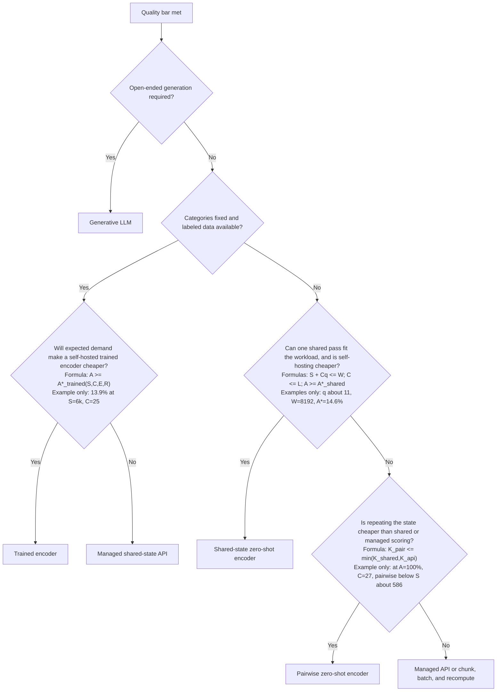
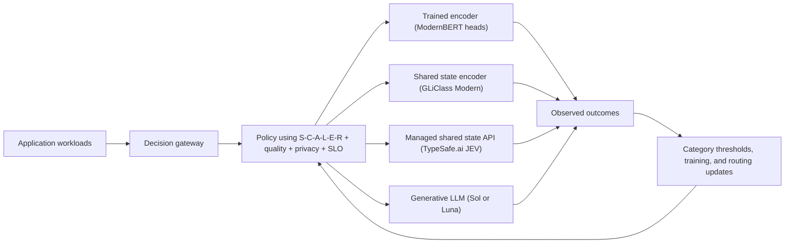

# Not Everything Should Be an LLM, Especially Classifiers - Generate When You Must. Classify When You Can.
*Inside Classifier Tokenomics: A Practical Guide to Choosing Between LLMs, TypeSafe.ai JEV, SLMs, and Open-Source Encoders*

## Classifiers are back in vogue - but which one should you choose?

If you are trying to add classification to your solution today, there are many options with different costs, accuracy, latency, and operating trade-offs. This guide is designed to help you understand those choices before selecting a model.

Classification is not one isolated feature; it is a decision pattern repeated everywhere. Support teams route tickets by intent, urgency, sentiment, and destination. Care organizations tag transcripts for contact reasons, promised actions, credits, compliance, resolution, churn risk, and agent quality. Claims teams categorize documents and missing evidence; security and IT triage alerts; finance flags exceptions; sales classifies leads; content platforms apply safety labels; and agentic systems choose tools or route work between economical and premium models.

A useful planning heuristic - not a universal industry statistic - is that an enterprise may have **dozens of distinct classification workloads and hundreds of individual labels or yes-or-no decisions** once those functions are counted. Our customer-care example is only one workflow, yet it already asks 27 questions of every transcript. That scale is why classifier architecture matters: a small difference in cost or latency is multiplied across every interaction, document, alert, and agent decision.

Purpose-built classifiers are attractive because they can be inexpensive, fast, and constrained. Encoder-style and other System 1 models score offered categories without generating an answer word by word. In the narrow sense, they do not hallucinate by inventing a new answer outside the supplied choices. They can still select the wrong category, reflect bias, drift, or be confidently wrong, so constrained output is not a substitute for evaluation and governance.

The economics can be dramatic. In the example workload later shown in Figure 6, Sol is the `1.0x` cost baseline, Luna is `19.5x` cheaper, the managed shared state API (TypeSafe.ai JEV) is `84.7x` cheaper, and the self-hosted trained and shared state encoders range from `58.2x` to `608.7x` cheaper as paid GPU utilization rises. Those are example raw-inference X-factors for a 6,000-token state, 25 questions, and the report's stated pricing assumptions - not universal price ratios - but they illustrate why classifier selection becomes material at enterprise scale.

Should you call a frontier LLM? Fine-tune a smaller model? Download an open-source encoder? Calibrate a zero-shot model? Build TF-IDF features and train a traditional linear model? Buy GPUs? Avoid buying GPUs? And now TypeSafe.ai has introduced JEV, a "System One" model that does not write essays at all. It takes a state, considers multiple questions, and returns typed decisions with probabilities.[2]

That sounds new. It also sounds strangely familiar. BERT-style encoders have been turning text into classifications for years.[3][4] In the broad product sense used in this guide, BERT-style classifier models are also **System 1** systems: they turn an input into fast scores or decisions rather than generating an open-ended answer token by token. That is a useful operating category, not a claim that BERT, GLiClass, and JEV share the same internal architecture. So is JEV a genuinely different architectural idea, a better product interface around a familiar idea, or both?

There is another important classifier family outside this comparison: traditional NLP pipelines that create features with word or character counts, TF-IDF, lexicons, or other engineered representations, then train a conventional model such as logistic regression, naive Bayes, a support-vector machine, or a tree ensemble.[1] Those approaches can be excellent for stable, well-labeled problems. This guide focuses on **Transformer-based classifiers and generative LLMs**, because the central question here is how different neural architectures process a shared state and multiple questions.

We ran a controlled benchmark to get past the slogans. The test used 1,000 synthetic customer-care conversations, 27 binary attributes, and a locked 150-conversation test set containing 4,050 individual decisions. We compared a pairwise zero-shot encoder (ModernBERT NLI), a trained encoder (ModernBERT with trained heads), a shared state encoder (GLiClass Modern), a managed shared state API (TypeSafe.ai JEV), and two generative LLMs (Luna and Sol).

The result was not a tidy "Model X wins" headline. It was more useful than that.

The best choice changes with four variables: **how long the state is, how many questions you ask, whether those questions are fixed, and how busy your paid hardware stays**. Latency adds a fifth constraint, because the cheapest fully utilized GPU can become the slowest user experience once requests start waiting in line.

The benchmark uses transcript analysis as a concrete example. The decision framework is broader: "state plus questions" also describes document review, tool routing, claims processing, safety checks, compliance, triage, and a surprising amount of agentic software. Transcript-specific cost translations are kept in the appendix so the main discussion remains general.

This is the practical guide I wish I had before we started testing.

## 1. First, understand the classifier model types, before getting enamored on any one solution

The logo on the model card matters less than the work the architecture repeats.

Imagine placing a 20-page case file on a desk and asking 27 yes-or-no questions about it. The case file is the **state**: the shared input every decision needs. Each yes-or-no question is a **classification category** such as "Was a credit requested?" The complete list of categories is the **taxonomy**.

One reviewer might reread the entire file before answering every question. Another might read it once, keep a working representation in memory, and answer all 27. A third might know the 27 questions in advance and use a purpose-built scorecard. Those approaches can produce similar answers while doing radically different amounts of work.

That is the heart of classifier tokenomics.

- **Pairwise zero-shot encoder (ModernBERT NLI):** combine the full state with each question. Flexible, but the state is effectively repeated once per question.[5]
- **Shared state encoder (GLiClass Modern):** combine one state with many natural-language category descriptions in a shared pass. Questions remain flexible at runtime.[6]
- **Trained encoder (ModernBERT with trained heads):** encode the state once, then apply small learned classifiers. Very efficient, but the taxonomy is fixed in the trained weights.[4]
- **Managed shared state API (TypeSafe.ai JEV):** submit one state and multiple typed questions to a managed service.[7]
- **Generative LLM (Sol or Luna):** ask one language model for all decisions in structured output, preserving broad reasoning ability.[8]


*Figure 1. A pairwise zero-shot encoder (ModernBERT NLI) repeats the state, a shared state encoder (GLiClass Modern) accepts runtime questions without repeating the state at the product boundary, and a trained encoder (ModernBERT heads) encodes the state once but fixes the taxonomy in advance.*

The picture makes the first trade-off visible. A pairwise zero-shot encoder (ModernBERT NLI) buys flexibility by doing repeated work. A trained encoder (ModernBERT heads) buys efficiency by fixing the list of categories in advance. A shared state encoder (GLiClass Modern) tries to preserve runtime flexibility without rereading the entire state for every category.

## 2. So what is Typescript.ai's managed shared state API (JEV), really?

TypeSafe.ai positions its managed shared state API (JEV) as a decision model rather than a language generator. You provide shared context - the state - and ask typed questions using primitives such as Noul, Choice, and Score. The service returns decisions and probabilities without generating a paragraph token by token.

From a product perspective, that is appealing. Classification code should not need to plead with a chatbot to return valid JSON, repair malformed output, or pay for a miniature essay that nobody wanted.

The public behavior is also interesting. In our scaling tests, the managed shared state API (TypeSafe.ai JEV) billing looked like:

```text
state tokens + N x question tokens + fixed overhead
```

It did not look like:

```text
N x (state tokens + question tokens)
```

Latency stayed roughly flat as the request grew from one to 16 questions. That supports TypeSafe.ai's claim that the questions are evaluated in parallel from the customer's point of view.

But here is an important line not to cross: an API shape is not an X-ray of a private neural network. These observations do not prove that the managed shared state API (TypeSafe.ai JEV) internally encodes the state exactly once. Caching, batching, late interaction, dual encoders, or another design could create similar external behavior. The useful claim we can test is simpler: **the API exposes shared-state economics and runtime-question flexibility at the product boundary.**

That alone is valuable. Whether the hidden architecture is entirely new remains a question for TypeSafe.ai to answer with technical disclosure.

## 3. Check accuracy first, and consider threshold optimization before complicated fine-tuning

For an AI practitioner, quality comes first. Begin with a locked test set containing answers the models have not seen, then compare every option on exactly the same examples.

Our running example used 150 held-out customer-care transcripts, 27 yes-or-no classification categories, and 4,050 total decisions. The chart starts with accuracy because it is the easiest overall quality measure to understand: the percentage of all decisions that were correct.


*Figure 2. Accuracy on the held-out transcript benchmark. Every bar identifies both the classifier model type and the tested implementation. This is an example quality test, not a claim that the same ranking will hold for every classification workload. Model documentation is listed in References [5]-[8] and [11].*

The generative LLM (Sol) made three errors. The calibrated managed shared state API (TypeSafe.ai JEV Noul) made four. The trained encoder (ModernBERT heads) reached 99.16% accuracy, while the uncalibrated pairwise zero-shot encoder (ModernBERT NLI) reached 92.96%.

For many business workflows, several solutions above 95% accuracy may already be sufficient. The acceptable bar depends on the cost and distribution of errors, so precision, recall, and category-level failure modes still matter. But once multiple candidates clear that quality bar, another tenth of a percentage point may matter less than tokenomics, p95/p99 latency, deployment effort, privacy, and operational flexibility. That is the point at which architecture selection should move from a leaderboard question to a systems question.

Before fine-tuning, look at the probabilities. Each classification category produces a probability. For example, a classifier might assign `0.73` to "credit requested." A **threshold** converts that probability into a yes-or-no output: if the threshold is `0.68`, the output is yes.

**Threshold optimization**, also called calibration here, uses a validation set with known answers to choose a separate cutoff for each category. It changes the decision rule, not the model weights. In this test, selecting 27 category-specific thresholds raised the pairwise zero-shot encoder (ModernBERT NLI) from 92.96% to 96.42% accuracy.


*Figure 3. Threshold optimization cut errors from 285 to 145 without changing the pairwise zero-shot encoder (ModernBERT NLI). The trained encoder (ModernBERT heads) reduced them further to 34.*

Threshold optimization recovered 55.8% of the accuracy gap between the raw pairwise zero-shot encoder and the trained encoder. It also preserved the model's ability to accept new questions. A new question can be scored immediately, although it will still need examples before its own threshold is validated.

A practical sequence is:

1. Establish accuracy on a locked test set.
2. Inspect precision and recall for each category so aggregate accuracy does not hide a weak minority class.
3. Optimize category thresholds using a separate validation set.
4. Move to a trained encoder (ModernBERT heads) only when the category list is stable and the remaining errors justify training.
5. Escalate low-confidence or genuinely ambiguous cases to a generative LLM (Sol or Luna) or a human.

Fine-tuning is not always step one. Sometimes a few well-chosen probability thresholds are the highest-return improvement in the project.

## 4. Evaluating Classifier Tokenomics using the S-C-A-L-E-R framework

Once an approach meets the quality target, use the **S-C-A-L-E-R framework** to understand its economics:

- `S` = **State size**, measured in tokens
- `C` = **Count of questions**, or classification categories
- `A` = **Accelerator utilization**, the share of paid GPU capacity doing useful inference
- `L` = **Labels per pass**, how many categories a shared state encoder can evaluate together
- `E` = **Expense per GPU-hour**
- `R` = **Processing rate**, the saturated processed-token throughput

The S-C-A-L-E-R framework is not another model. It is a workload checklist for comparing architectures on equal terms.

When quality is already sufficient, these variables can become measurable decision thresholds rather than a checklist. Define `K100,m(S,C,L,E,R)` as the modeled cost of self-hosted model class `m` at 100% paid utilization, and `Kapi(S,C)` as the comparable managed-service cost. The paid-utilization break-even is:

```text
A*_m(S,C,L,E,R) = K100,m(S,C,L,E,R) / Kapi(S,C)
self-host model m is cheaper when A >= A*_m
```

Two more thresholds make the framework actionable. Let `q` be the average tokens required to describe one question or category and `W` be the model context window. A shared state encoder can handle the workload in one pass when `S + Cq <= W` and `C <= L`. A pairwise zero-shot encoder should remain a candidate only while its modeled cost - including `C` copies of the state - is no greater than the shared-state and managed alternatives and its measured p95/p99 latency stays inside the service objective.

The thresholds are workload-specific, not universal constants. Under this report's reference assumptions, a 6,000-token state and 25 questions produce modeled utilization break-evens of approximately `13.9%` for a trained encoder and `14.6%` for a shared state encoder. For the tested shared state encoder (GLiClass Modern), `q` was approximately 11 tokens and `W` was 8,192, so the one-pass context test becomes `S + 11C <= 8,192`, subject also to its label limit `L`. At 100% paid utilization and 27 questions, the managed shared state API (TypeSafe.ai JEV Noul) becomes cheaper than the pairwise zero-shot encoder (ModernBERT NLI) at approximately `S = 586` state tokens under the stated pricing and throughput assumptions.

The decision diagram appears after Figures 8-10 so the cost surfaces establish the evidence before the thresholds are applied.

For a self-hosted model, the raw inference cost per 1,000 states is approximately:

```text
cost = 1,000 x processed tokens per state x E
       / (R x A x 3,600)
```

The phrase "processed tokens per state" does the heavy lifting. A model that rereads the state for every question processes much more work than one that shares or precompiles the state.

For a pairwise zero-shot encoder (ModernBERT NLI), processed tokens grow roughly like `C x S`, plus question tokens. For a trained encoder (ModernBERT heads), they are much closer to `S` once, followed by cheap classifiers. For a shared state encoder (GLiClass Modern), they are roughly the state plus category descriptions, subject to context limits and label batching. The managed shared state API (TypeSafe.ai JEV) is usage-priced, so customer cost follows metered tokens rather than the utilization of a GPU you own.


*Figure 4. Cost sensitivity for 27 questions on a $5-per-hour H100 running at 100% paid GPU utilization. Hosted services remain usage-priced. The chart includes context-window chunking and uses throughput proxies rather than production H100 measurements.*

Figure 4 deliberately assumes 100% paid H100 utilization so it compares raw inference efficiency. That is the best-case self-hosted cost, not the utilization most teams achieve on day one.

The shape matters more than any single dollar value. As the state grows, rereading it for every question gets expensive quickly. That is why a pairwise zero-shot encoder (ModernBERT NLI) can look reasonable on a short request and painful on a long document.


*Figure 5. Cost as the question count grows for short, medium, and long states. A pairwise zero-shot encoder (ModernBERT NLI) becomes increasingly expensive because each question carries another copy of the state.*

Going from 10 to 50 questions is not "just 40 more outputs" for every architecture. For a pairwise zero-shot encoder, it can mean 40 additional state-question pairs. For a trained encoder (ModernBERT heads), it mostly means 40 inexpensive output heads. For the managed shared state API (TypeSafe.ai JEV), it means additional question tokens without customer-visible repetition of the state.

And what happens when a state is too large for the model's context window? You chunk it: split the state into sections, classify the sections, and combine their evidence. Chunks can run in parallel, but parallel is not free. They still consume accelerator time, and simultaneous execution may require more GPUs or less capacity for other requests.

This is why a 32K-token x-axis matters: it exposes where context limits, chunk count, and infrastructure capacity change the economics.

The next S-C-A-L-E-R variable is accelerator utilization (`A`). The example below uses 1,000 states, 6,000 tokens per state, 25 questions, and a $5-per-hour H100. Unlike Figure 4, it deliberately varies utilization. Read each panel as the same workload placed on progressively busier self-hosted infrastructure; managed-service prices do not change with customer GPU utilization.


*Figure 6. The managed shared state API (TypeSafe.ai JEV) remains usage-priced while self-hosted trained and shared state encoders become less expensive as paid H100 utilization rises. Each label also shows an X-factor: the most expensive bar in that panel divided by the solution's cost. Sol is the 1.0x baseline in this example.*

Figure 6 shows both direction and scale. At low utilization, every useful request absorbs more idle GPU cost; as utilization rises, self-hosted costs fall. In this example, the managed shared state API (TypeSafe.ai JEV) is `84.7x` cheaper than Sol at every utilization and Luna is `19.5x` cheaper because all three remain usage-priced. The trained encoder (ModernBERT heads) moves from `60.9x` at 10% utilization to `608.7x` at 100%, while the shared state encoder (GLiClass Modern) moves from `58.2x` to `582.2x`. These are example raw-inference multiples under the stated assumptions, not universal price ratios; hidden LLM reasoning tokens are excluded.

Use S-C-A-L-E-R to decide which X-factor matters. `S` and `C` quantify repeated work, `A` captures idle accelerator cost, `L` tests whether labels fit in a shared pass, and `E` and `R` convert compute into dollars. First use quality, output type, and category flexibility to identify eligible model classes; then calculate their scenario costs. The X-factor is the final magnitude check, not a standalone model ranking.


*Figure 7. Modeled raw-inference crossover bands. In this reference scenario, the managed shared state API (TypeSafe.ai JEV) wins below approximately 13.9% utilization when fixed categories are allowed and 14.6% when questions must remain flexible.*

These are cost crossovers, not purchasing recommendations. A team should not buy a GPU because a line crosses at 14%. Reliability, redundancy, engineering, monitoring, burst capacity, and latency headroom all raise the practical bar for self-hosting. The bands are useful because they turn utilization from a vague concern into a measurable assumption that can be challenged.

Now use the S-C-A-L-E-R framework as a decision map. Start with the more versatile requirement: questions may change after deployment. That excludes a trained encoder whose category list is fixed in its weights. Figure 8 varies state length, question count, and utilization together, then names the lowest modeled cost among the remaining runtime-flexible choices.


*Figure 8. Lowest-cost runtime-flexible approach across state size, question count, and paid H100 utilization. The eligible choices include a shared state encoder (GLiClass Modern), managed shared state API (TypeSafe.ai JEV), pairwise zero-shot encoder (ModernBERT NLI), and generative LLMs.*

At 10% paid utilization, the managed shared state API (TypeSafe.ai JEV) wins many of the longer-state cells because there is no customer-owned idle accelerator to amortize. At 25% and above, the shared state encoder (GLiClass Modern) wins this modeled runtime-flexible grid. That does not make it universally better: the map excludes platform engineering, redundancy, and differences in measured quality.


*Figure 9. Percentage cost advantage of the runtime-flexible winner over the runner-up. Low-percentage cells indicate close decisions.*

Figure 9 asks how decisive each runtime-flexible winner is. A 3% advantage is permission to choose based on privacy, support, latency, or operational simplicity; a 70% advantage deserves a harder economic look. Treat pale cells cautiously because a small change in throughput, price, or utilization could reverse the decision. Darker cells give the winner more economic room before operational considerations overturn it.


*Figure 10. Lowest-cost approach when the list of classification categories is fixed and a trained encoder (ModernBERT heads) is eligible.*

Figure 10 is deliberately last because fixed taxonomy is a separate design choice. When the category list is stable, a trained encoder (ModernBERT heads) becomes eligible: question meaning is compiled into learned heads, so inference encodes the state once and applies inexpensive classifiers. Once utilization is sustained, it dominates the modeled cost grid. The trade-off is explicit: adding a category requires labeled examples and retraining.

With the versatile and fixed-taxonomy cost maps now visible, the S-C-A-L-E-R decision framework below turns the workload into explicit gates. Each box asks the decision in plain English; the smaller text gives the supporting formula and clearly labeled examples from this report. Recalculate those examples for the actual deployment rather than copying them into production.



This is a screening framework, not an automatic purchasing rule. Replace every example with measured throughput, all-in platform cost, realistic utilization, label and context limits, and latency headroom before committing to a deployment.

## 5. Governance: lighter does not mean absent

Closed-output classifiers have a useful governance advantage over generative LLMs. They do not hallucinate in the narrow sense of inventing a new answer that was not among the options you supplied, and encoder classifiers do not generate word-tokens one after another. They return scores or typed decisions from a constrained output space. Their low inference cost also makes broad regression testing, shadow evaluation, and continuous monitoring affordable.

That can justify **light-touch governance for low-impact classification**, but not no governance. A classifier can still choose the wrong option, attach unjustified confidence to it, reflect bias in its training data, or degrade when the input distribution changes. High-impact decisions involving safety, employment, credit, healthcare, or legal rights still require controls proportionate to the consequence.

The practical control is a centralized decision gateway. Require applications to access classifier models through that gateway so the platform can record the model and version, question schema, probability, threshold, chosen answer, latency, fallback path, and subsequent outcome. Monitor accuracy and drift by category, preserve an auditable threshold history, restrict access to sensitive state, and escalate low-confidence or high-impact cases to human review or a stronger policy path.

## 6. What an enterprise platform team should do

One application may never keep a GPU busy. Many applications sharing the same platform might. That is the enterprise opportunity: pool steady workloads on self-hosted encoders, preserve capacity for interactive traffic, and use managed services for bursts or specialized work.

The concrete platform recommendation is to **stand up a shared-state System 1 classification API**. Give application teams one stable contract: submit a state once, attach multiple named questions, and receive typed answers with probabilities. The platform can initially route that contract to a managed shared state API (TypeSafe.ai JEV), then add a self-hosted shared state encoder (GLiClass Modern), trained encoders for stable high-volume categories, and generative LLM fallbacks without forcing every application to rewrite its integration. Centralize model versioning, threshold calibration, audit logs, latency policy, and fallback behavior behind that API.

Bring the platform team measured evidence, not a model shopping list. Use the S-C-A-L-E-R framework: state-size distribution, question count, expected accelerator utilization, labels per pass, GPU expense, and measured processing rate. Add data-residency constraints and the expected escalation rate.

Treat latency as a guardrail rather than another model leaderboard. Define the p95 and p99 response-time targets, test them with realistic bursts and concurrency, and reserve enough capacity to prevent queueing from erasing the cost advantage of high utilization. The detailed latency method is in the appendix.

Before moving a workload from a managed API to self-hosted infrastructure, require five green lights:

1. Quality parity on a production shadow set.
2. Sustained demand - not a temporary peak - beyond the all-in cost crossover.
3. A credible plan to pool workloads and maintain useful accelerator utilization.
4. The p95 and p99 latency targets are met with operational headroom.
5. Funding for reliability, security, observability, and model ownership.

The platform question is not simply "Can we host it?" It is "Can we host it reliably, keep it busy enough to justify the fixed cost, and still meet the latency objective?"

## 7. The architecture I would actually deploy

Do not force one model to handle every decision. Put a stable decision gateway in front of the available model classes and let policy route each request using quality, privacy, latency, and the S-C-A-L-E-R workload variables.



The gateway is where the strategy lives. Flexible runtime questions can go to a shared state encoder (GLiClass Modern) or managed shared state API (TypeSafe.ai JEV). Stable, high-volume categories can go to a trained encoder (ModernBERT heads). Truly ambiguous work can escalate to a generative LLM (Sol or Luna). Outcomes feed the next round of threshold optimization and training.

This is less glamorous than declaring one universal winner. It is also how you keep quality high without paying the premium path for every easy case.

## 8. The answer, without the consultant fog

If questions must change at runtime and demand is new, bursty, or uncertain, a managed shared state API (TypeSafe.ai JEV) preserves flexibility without customer-owned idle GPU capacity.

If questions must change at runtime and a shared GPU service can remain productively utilized, a shared state encoder (GLiClass Modern) is compelling.

If the category list is fixed and demand is sustained, a trained encoder (ModernBERT heads) is extremely hard to beat.

If the task needs open-ended reasoning, nuanced synthesis, or generation, use a generative LLM (Sol or Luna). Just do not pay for those abilities automatically when the job is a typed decision.

Before fine-tuning anything, optimize the probability threshold for each category. In our test, that simple step recovered more than half the accuracy gap between the pairwise zero-shot encoder (ModernBERT NLI) and trained encoder (ModernBERT heads).

The big lesson is not that old BERT models are back, or that JEV replaces them, or that LLMs are too expensive. The lesson is that classification is becoming a systems design problem again.

The winning stack will usually be hybrid, measured, and slightly boring under the hood. That is a compliment. When the architecture matches the workload, the exciting part is not the model. It is how little you have to pay to make the right decision.

**Footnote - what we are testing now.** We are testing `Askatt_System1_api`, a JEV-compatible API built on a shared state encoder (GLiClass Modern). It accepts one shared state plus multiple questions and supports both Choice- and Noul-style decisions. The goal is to enable "SCALEable" shared-state solutions - pun intended - with faster classification and modeled raw-inference cost more than `50x` below the Sol baseline in this report's example scenario, while remaining JEV-schema-compatible should that schema become more widely available in the future. This is not a claim that `Askatt_System1_api` reproduces JEV's private architecture.

**At this point, I hope you can see that the smartest token may be the one you never generate. Happy classifying...!**

## Appendix: latency design, transcript benchmark, and reference scenarios

**Latency design details.** Throughput, model service time, and end-to-end latency are related, but they are not the same:

```text
end-to-end latency = queueing + preprocessing + model service
                     + postprocessing + network
```

The H100 estimates in this report describe the model-service component. They are not promises about production p95 or p99 latency. **P95 latency** is the time within which 95% of requests complete; **P99 latency** is the corresponding boundary for 99% of requests. Averages cannot show whether the slowest requests take two seconds or twenty.[9][10]

Design for those percentiles explicitly:

1. Define separate end-to-end latency objectives for interactive, batch, and fallback traffic, including the measurement window.
2. Divide the target into queueing, preprocessing, network, model-service, and postprocessing budgets. Measure at the client boundary and inside the model service.
3. Load-test the real distribution of state sizes and question counts, including bursts and concurrent requests, at several utilization levels.
4. Size replicas and reserve headroom so measured p95 and p99 remain inside the objective. Bound queues, use timeouts, and define load shedding or managed-service fallback before saturation.
5. Monitor latency histograms by model, state-size bucket, question count, and traffic class. A single fleet-wide percentile can hide the workload that is failing.

A self-hosted encoder can have excellent raw throughput and still feel slow when a highly utilized GPU creates a queue. A hosted API may add network overhead but absorb bursts more gracefully. Utilization makes self-hosting economical; headroom keeps it responsive. The correct operating point depends on whether the workload is an offline batch or an interactive decision.

**Transcript benchmark and reference scenarios.** The main article uses state size and question count as general variables. The views below translate those variables into a transcript example for reproducibility.


*Figure 11. Transcript-specific translation of state size into approximate call duration at 10, 25, and 50 questions. The main article uses state tokens directly.*


*Figure 12. Reference decision matrix for a 6,000-token state and 25 questions. It is an illustrative scenario rather than a general decision rule; use the S-C-A-L-E-R framework for the actual workload.*

## References

1. scikit-learn. [Working with text documents: feature extraction and traditional machine-learning classifiers](https://scikit-learn.org/stable/auto_examples/text/index.html).
2. TypeSafe.ai. [Introducing System One Models and Jev](https://typesafe.ai/blog/introducing-system-one-models-and-jev).
3. Devlin, Chang, Lee, and Toutanova. [BERT: Pre-training of Deep Bidirectional Transformers for Language Understanding](https://arxiv.org/abs/1810.04805).
4. Warner et al. [ModernBERT: Smarter, Better, Faster, Longer](https://arxiv.org/abs/2412.13663).
5. Moritz Laurer. [ModernBERT-large-zeroshot-v2.0 model card](https://huggingface.co/MoritzLaurer/ModernBERT-large-zeroshot-v2.0).
6. Stepanov et al. [GLiClass Modern Large v3 model card and paper](https://huggingface.co/knowledgator/gliclass-modern-large-v3.0).
7. TypeSafe.ai. [JEV API reference](https://docs.typesafe.ai/api) and [models, limits, pricing, and parallel-question behavior](https://docs.typesafe.ai/models).
8. OpenAI. [API model catalog for GPT-5.6 Sol and Luna](https://platform.openai.com/docs/models).
9. Google Site Reliability Engineering. [Service Level Objectives and percentile latency](https://sre.google/sre-book/service-level-objectives/).
10. Dean and Barroso. [The Tail at Scale](https://research.google/pubs/the-tail-at-scale/).
11. Moritz Laurer. [DeBERTa-v3-large-zeroshot-v2.0-c model card](https://huggingface.co/MoritzLaurer/deberta-v3-large-zeroshot-v2.0-c).
