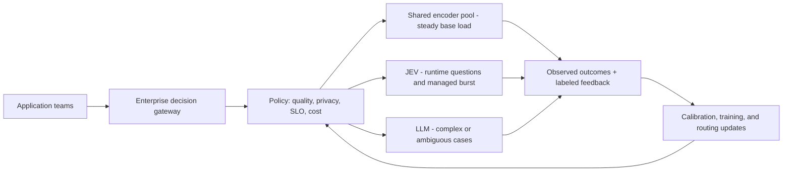

# Inside Classifier Tokenomics: Cost, Latency, and When to Use LLMs, TypeSafe.ai JEV, SLMs, or Open-Source Encoders

## Opening

Too many options, too many curves, and too many claims. Should a classifier be a frontier LLM, a small language model, a hosted “System One” API, a zero-shot encoder, calibrated thresholds, or a fully trained model? Should a data scientist call an API, download a checkpoint, or ask the platform team to buy H100s? And what is JEV doing differently enough to change the answer?

The uncomfortable truth is that “which model is best?” is usually the wrong question. The useful answer changes with four variables: **state length, number of questions, quality target, and paid hardware utilization**. Latency adds a fifth constraint because the cheapest saturated system may be the worst interactive system once requests queue.

This article maps the choices from two perspectives: the practitioner shipping one use case and the enterprise team operating a shared platform for many teams.

## 1. One classification task, five execution patterns

- Pairwise zero-shot encoder: repeat the state for every arbitrary question.
- Shared-state runtime-label encoder: serialize one state with many labels.
- Fixed-taxonomy trained heads: encode the state once; label semantics live in weights.
- Hosted shared-state API: submit one state plus arbitrary typed questions.
- Single-call LLM: prompt for all decisions and structured output.

Include Mermaid diagrams showing the state path, question path, and cost driver for each.

## 2. What JEV is - and what the public evidence establishes

- Noul, Choice, and Score primitives.
- One shared state plus arbitrary runtime questions.
- Current documented context, pricing, and parallel evaluation behavior.
- Clear distinction between observed/documented interface behavior and undisclosed architecture.
- Why a GLiClass compatibility layer is useful without claiming it reproduces JEV.

## 3. The quality ladder from this benchmark

- Raw zero-shot encoders.
- Validation-calibrated zero-shot encoders.
- Trained ModernBERT heads.
- JEV Noul and Choice.
- Luna and Sol.
- Highlight: calibration closed more than half the ModernBERT zero-shot-to-trained gap while preserving runtime question flexibility for the known labels.

## 4. Tokenomics: the variables that actually move cost

Define:

- `S`: state tokens
- `N`: number of questions
- `U`: paid GPU utilization
- `R`: saturated processed-token throughput
- `P`: GPU price/hour
- `L`: compiled labels per pass

Explain cost formulas for pairwise, shared-state, fixed-head, hosted, and LLM systems. Show the 10/25/50-question curves, state-length curves, and utilization crossovers.

## 5. Latency: resource time is not response time

- Model-service time from the H100 throughput proxy.
- Network and API overhead for hosted systems.
- Queueing growth as utilization approaches saturation.
- Interactive p95/p99 versus offline throughput.
- Parallel chunks require additional concurrent capacity; they do not remove compute.

## 6. The data scientist's decision path

- Start with labeled examples and the simplest deployable baseline.
- Use hosted APIs or local CPU before buying infrastructure.
- Evaluate quality per label, not only aggregate accuracy.
- Calibrate thresholds on validation data.
- Escalate ambiguous cases to an LLM or human.
- Bring evidence - request rate, state lengths, question counts, burstiness, and SLO - to the platform team.

## 7. The enterprise platform team's decision path

- Consolidate workloads into a multi-tenant pool.
- Separate stable base load from bursts.
- Pin models and version decision policies.
- Protect interactive capacity with utilization headroom.
- Make data-residency, security, audit, support, and failure-mode costs explicit.
- Use hosted overflow and keep an exit path in both directions.

## 8. When to move off a cloud API

Use a decision gate, not a slogan:

1. Quality parity on a production shadow set.
2. Sustained demand, not peak demand, exceeds the all-in cost crossover.
3. The platform can keep accelerators productively shared.
4. Measured p95/p99 meets the SLO with headroom.
5. Reliability, privacy, and operational ownership are funded.

Illustrate the 6,000-state-token, 25-question reference: GLiClass's raw-inference crossover with JEV is about 14.6% paid utilization, while a prudent operational review would occur at a higher sustained utilization after including platform costs.

## 9. AskATT_system1_api: a portable compatibility experiment

- Same `POST /v1/systemone` envelope.
- Noul and Choice adapters over GLiClass Modern Large.
- One shared pass for the 27-question test.
- 94.10% accuracy / 89.57% F1 without calibration.
- What is compatible and what is intentionally different.
- How an enterprise could use the interface as a routing seam across JEV, local encoders, and LLM escalation.

## 10. A pragmatic reference architecture

## 11. Bottom line

- Fixed taxonomy plus sustained scale: trained heads are difficult to beat.
- Runtime questions plus efficient self-hosting: shared-state zero-shot encoders are compelling.
- Variable or early demand: usage-priced JEV avoids utilization risk.
- Complex reasoning or ambiguity: use an LLM selectively, not automatically.
- The winning enterprise design is usually hybrid and instrumented.

