# Inside Classifier Tokenomics: A Practical Guide to Choosing Between LLMs, TypeSafe.ai JEV, SLMs, and Open-Source Encoders

## Opening

Too many options, too many curves, and too many claims. Should a classifier be a frontier LLM, a small language model, a hosted “System One” API, a zero-shot encoder, calibrated thresholds, or a fully trained model? Should a data scientist call an API, download a checkpoint, or ask the platform team to buy H100s? And what is JEV doing differently enough to change the answer?

The uncomfortable truth is that “which model is best?” is usually the wrong question. The useful answer changes with four variables: **state length, number of questions, quality target, and paid hardware utilization**. Latency adds a fifth constraint because the cheapest saturated system may be the worst interactive system once requests queue.

This article maps the choices from two perspectives: the practitioner shipping one use case and the enterprise team operating a shared platform for many teams.

The examples use transcript classification because it gives us a concrete workload, but the framework applies to any problem with a large shared state and multiple decisions: document processing, tool routing, safety gates, claims review, compliance checks, or product recommendations.

## 1. One classification task, five execution patterns

- Pairwise zero-shot encoder: repeat the state for every arbitrary question.
- Shared-state runtime-label encoder: serialize one state with many labels.
- Fixed-taxonomy trained heads: encode the state once; label semantics live in weights.
- Hosted shared-state API: submit one state plus arbitrary typed questions.
- Single-call LLM: prompt for all decisions and structured output.

Include Mermaid diagrams showing the state path, question path, and cost driver for each.

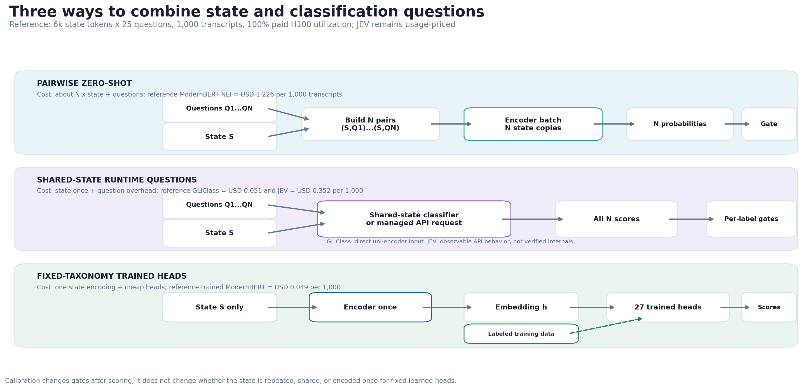

*Figure 1. The central architectural distinction: pairwise zero-shot repeats the state, shared-state systems accept runtime questions without repeating the state at the product boundary, and trained heads encode the state once but fix the taxonomy in advance.*

## 2. What JEV is - and what the public evidence establishes

- Noul, Choice, and Score primitives.
- One shared state plus arbitrary runtime questions.
- Current documented context, pricing, and parallel evaluation behavior.
- Clear distinction between observed/documented interface behavior and undisclosed architecture.
- Why a GLiClass compatibility layer is useful without claiming it reproduces JEV.

## 3. The quality ladder from this benchmark

- Raw zero-shot encoders.
- Validation-calibrated zero-shot encoders.
- Trained ModernBERT heads.
- JEV Noul and Choice.
- Luna and Sol.
- Highlight: calibration closed more than half the ModernBERT zero-shot-to-trained gap while preserving runtime question flexibility for the known labels.

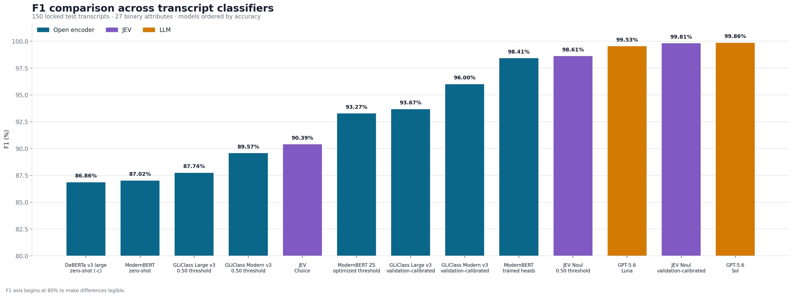

*Figure 2. Held-out micro F1 across 4,050 binary decisions. F1 is the primary comparison because the positive and negative classes are imbalanced.*

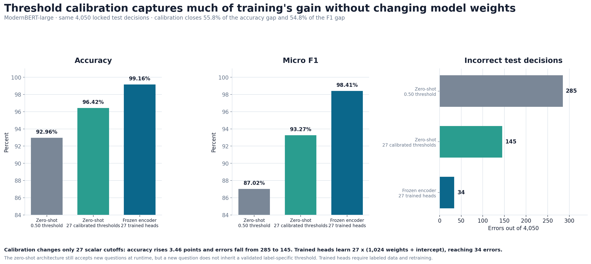

*Figure 3. Calibration changes 27 scalar decision thresholds without changing the encoder weights. It cut ModernBERT errors from 285 to 145; trained heads reduced them to 34.*

## 4. Tokenomics: the variables that actually move cost

Define:

- `S`: state tokens
- `N`: number of questions
- `U`: paid GPU utilization
- `R`: saturated processed-token throughput
- `P`: GPU price/hour
- `L`: compiled labels per pass

Explain cost formulas for pairwise, shared-state, fixed-head, hosted, and LLM systems. Show the 10/25/50-question curves, state-length curves, and utilization crossovers.

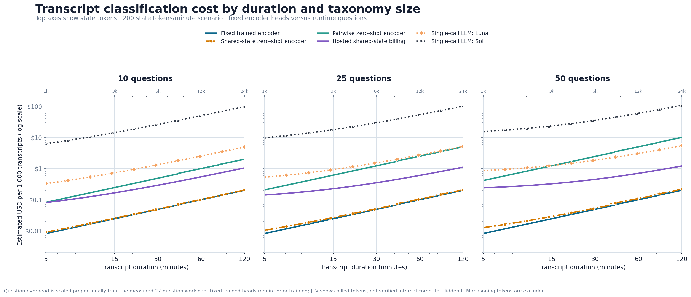

*Figure 4. Cost as the state grows, shown at 10, 25, and 50 questions. The transcript-duration labels are an example; the upper axis is the reusable state-token variable.*

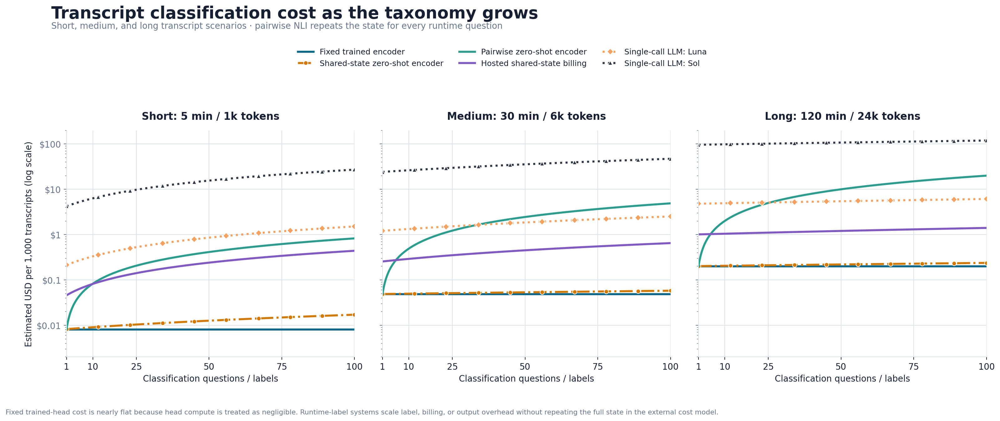

*Figure 5. Cost as the taxonomy grows for short, medium, and long states. Pairwise NLI becomes increasingly expensive because every new question carries another copy of the state.*

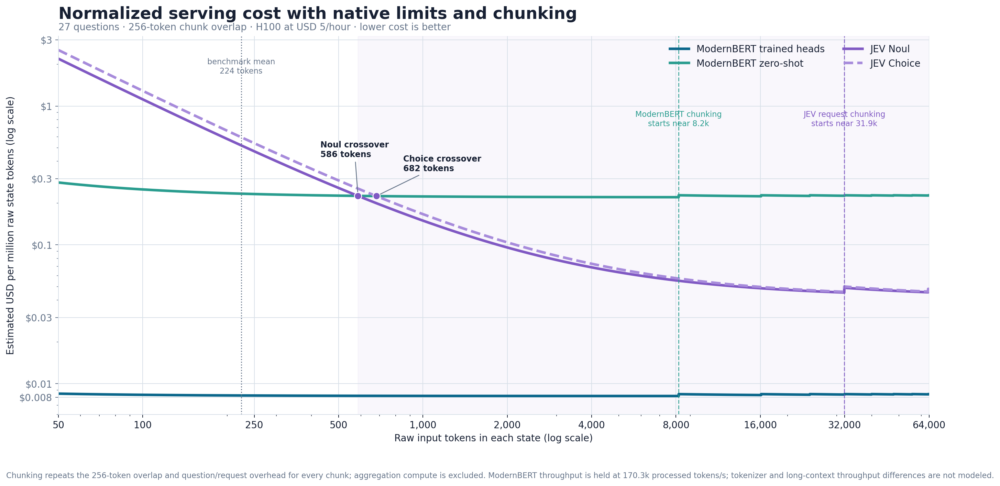

*Figure 6. The detailed 27-question state-length sensitivity, including context-window chunking. This is the bridge between the generic formulas and the measured transcript example.*

## 5. Latency: resource time is not response time

- Model-service time from the H100 throughput proxy.
- Network and API overhead for hosted systems.
- Queueing growth as utilization approaches saturation.
- Interactive p95/p99 versus offline throughput.
- Parallel chunks require additional concurrent capacity; they do not remove compute.

Use the following relationship in the article instead of an accuracy-versus-latency scatter:

```text
end-to-end latency = queueing + preprocessing + model service
                     + postprocessing + network
```

The model-throughput estimate describes the `model service` component. It is not a p95 or p99 production latency promise.

## 6. The data scientist's decision path

- Start with labeled examples and the simplest deployable baseline.
- Use hosted APIs or local CPU before buying infrastructure.
- Evaluate quality per label, not only aggregate accuracy.
- Calibrate thresholds on validation data.
- Escalate ambiguous cases to an LLM or human.
- Bring evidence - request rate, state lengths, question counts, burstiness, and SLO - to the platform team.

## 7. The enterprise platform team's decision path

- Consolidate workloads into a multi-tenant pool.
- Separate stable base load from bursts.
- Pin models and version decision policies.
- Protect interactive capacity with utilization headroom.
- Make data-residency, security, audit, support, and failure-mode costs explicit.
- Use hosted overflow and keep an exit path in both directions.

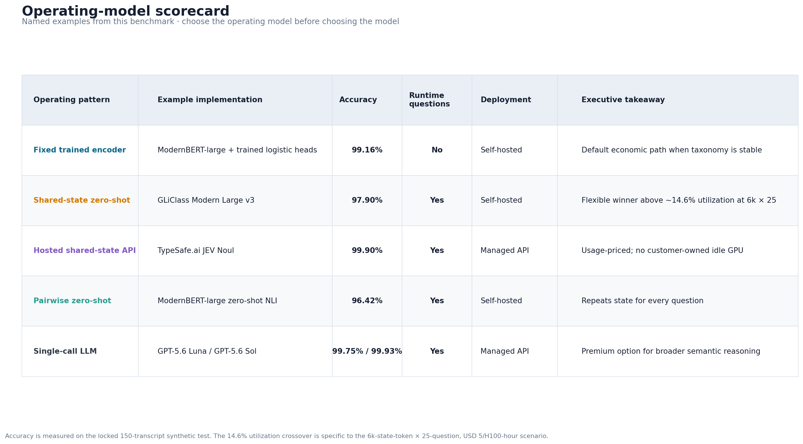

*Figure 7. Choose the operating pattern before choosing a particular model. The critical split is fixed versus runtime taxonomy, followed by managed versus self-hosted deployment.*

## 8. When to move off a cloud API

Use a decision gate, not a slogan:

1. Quality parity on a production shadow set.
2. Sustained demand, not peak demand, exceeds the all-in cost crossover.
3. The platform can keep accelerators productively shared.
4. Measured p95/p99 meets the SLO with headroom.
5. Reliability, privacy, and operational ownership are funded.

Illustrate the 6,000-state-token, 25-question reference: GLiClass's raw-inference crossover with JEV is about 14.6% paid utilization, while a prudent operational review would occur at a higher sustained utilization after including platform costs.

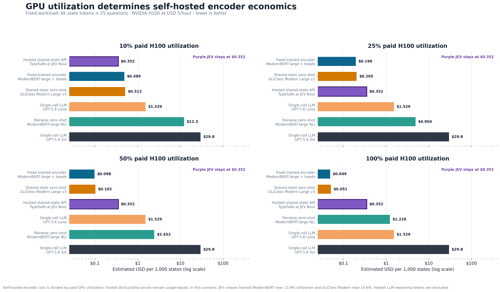

*Figure 8. Usage-priced JEV remains constant while self-hosted encoder cost falls as paid GPU utilization rises. The bars use a 6,000-token state, 25 questions, and a $5/H100-hour scenario.*

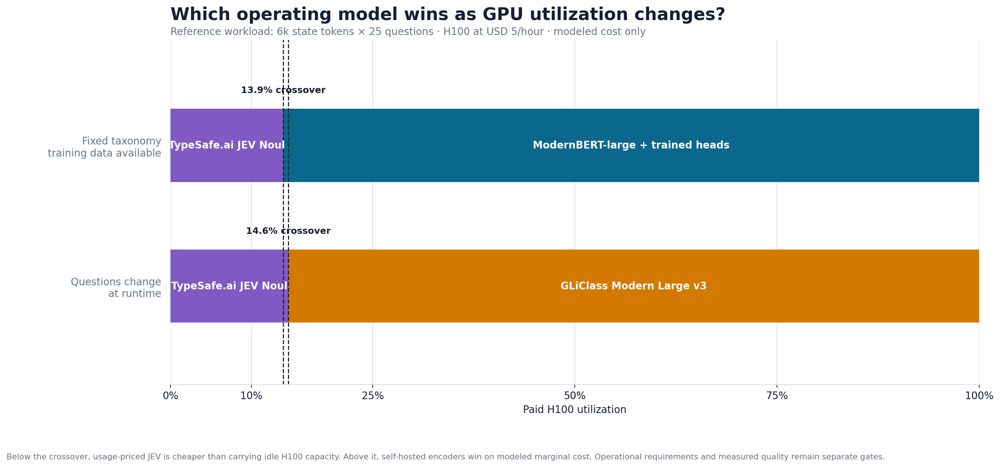

*Figure 9. Modeled marginal-cost crossover bands. JEV wins below approximately 13.9% utilization for a fixed taxonomy and 14.6% when questions must change at runtime. Quality and operational readiness remain separate gates.*

For readers who need all three variables at once, include the paired decision maps immediately after the crossover discussion:

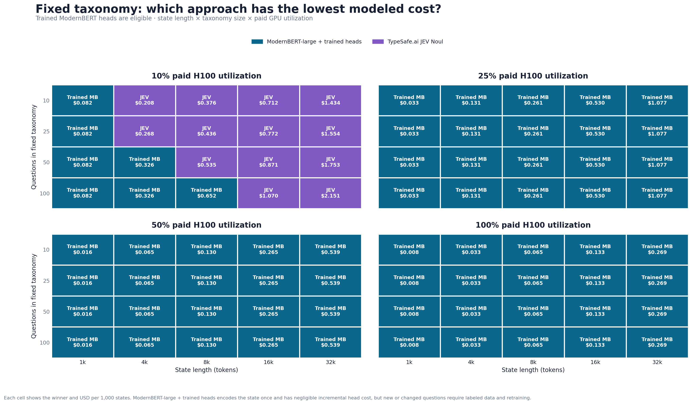

*Figure 10. Lowest-cost eligible approach across state length, question count, and utilization when trained heads are allowed.*

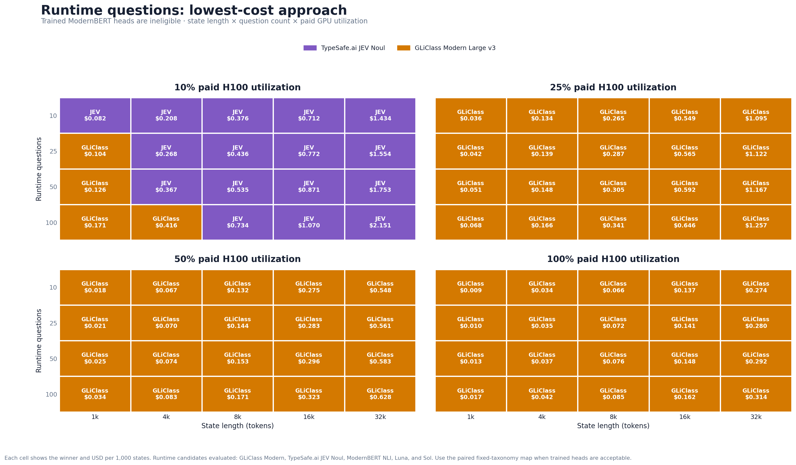

*Figure 11. The same state-length, question-count, and utilization grid when fixed trained heads are not eligible.*

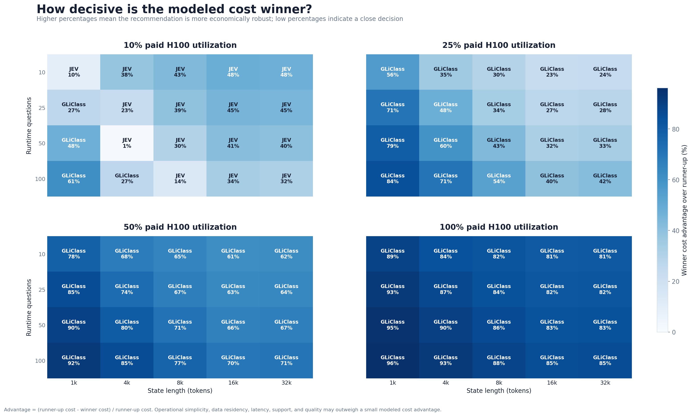

*Figure 12. The winning runtime-flexible approach's percentage cost advantage over the runner-up. Low-percentage cells identify close decisions where quality, support, latency, data residency, or operational simplicity may matter more than the modeled savings.*

## 9. What we are testing now

- Whether the strongest open-source shared-state option can provide the same practical state-plus-questions experience.
- How its throughput, latency, calibration, and economics change on production-style hardware.
- Whether one enterprise decision layer can route between trained encoders, runtime-label encoders, JEV, and selective LLM escalation.
- Keep this deliberately brief: the work is underway, and results will follow.

## 10. A pragmatic reference architecture

Before the implementation diagram, summarize the available operating positions in one executive view:

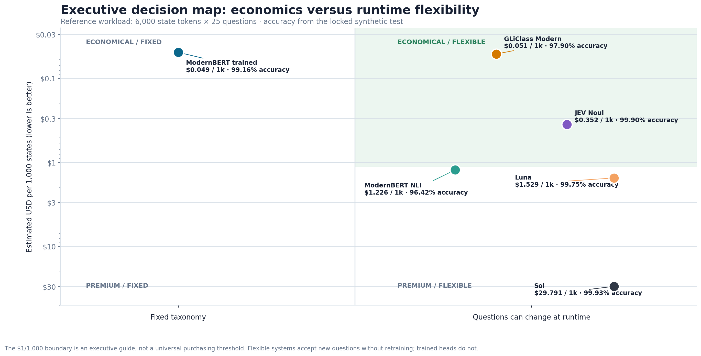

*Figure 13. There is no single classifier winner. Trained ModernBERT leads the economical/fixed corner, GLiClass represents economical/runtime-flexible self-hosting, JEV provides a managed flexible option, and LLMs occupy the premium reasoning tier.*

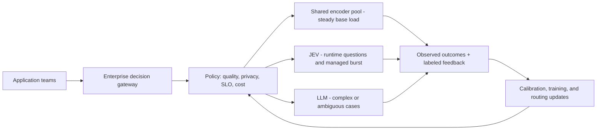

## 11. Bottom line

- Fixed taxonomy plus sustained scale: trained heads are difficult to beat.
- Runtime questions plus efficient self-hosting: shared-state zero-shot encoders are compelling.
- Variable or early demand: usage-priced JEV avoids utilization risk.
- Complex reasoning or ambiguity: use an LLM selectively, not automatically.
- The winning enterprise design is usually hybrid and instrumented.

## Visual editorial notes

- Lead with the architecture picture, not a benchmark leaderboard; the article is a decision guide.
- Use F1 as the main quality chart and the calibration chart as the practical intervention.
- Keep both generic cost charts because they isolate the two variables readers control: state length and number of questions.
- Keep the detailed state-token chart after the generic charts, where technical readers can inspect chunking effects.
- Put the utilization bars and crossover bands in the cloud-versus-self-hosting section.
- Put the two heatmaps together; they are a paired comparison and use the same axes.
- Follow the runtime winner map with the savings-advantage heatmap so readers can distinguish decisive wins from near ties.
- Use the 2x2 matrix immediately before the reference architecture as the executive synthesis.
- Do not use `estimated-cost-1000-transcripts.png` in the article because it compares API charges with local models whose hardware cost is shown as zero.
- Do not use `accuracy-vs-equivalent-latency.png`; the measurements mix hosted round trips, local CPU runs, and H100 resource-time estimates.
- Keep `accuracy-comparison.png` and `all-metrics-table.png` as optional supporting figures for the technical report rather than the main article.
