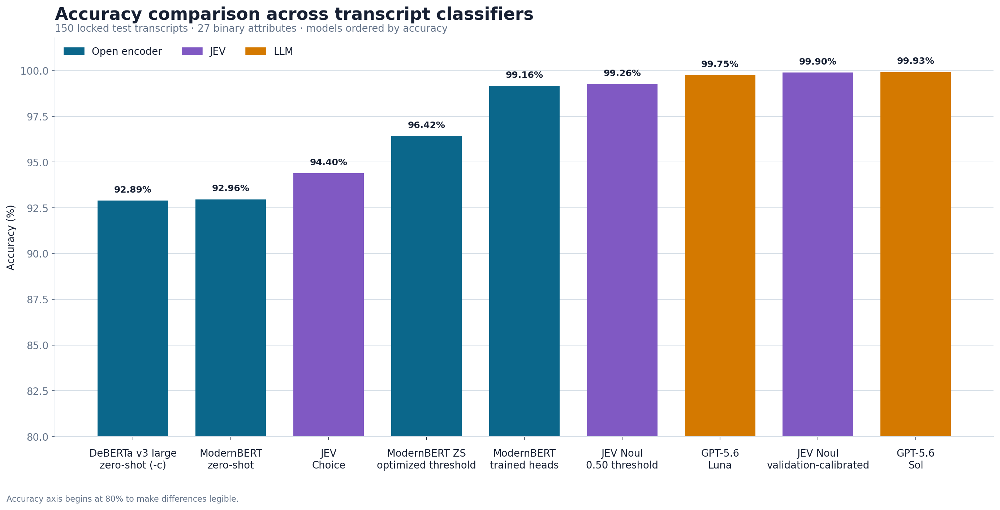
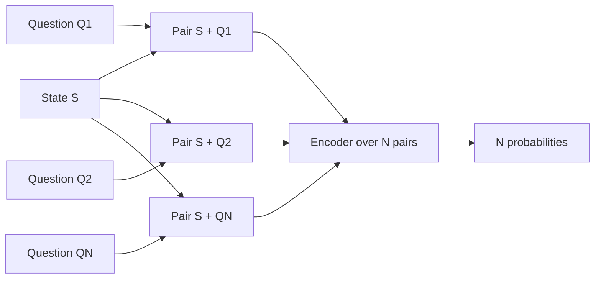
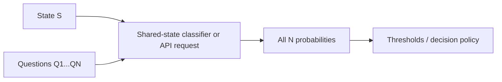
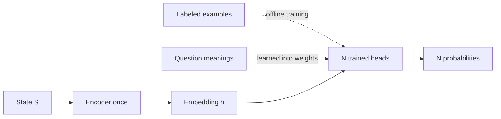

# The model that does not write: benchmarking JEV against BERT classifiers and frontier LLMs

*An independent smoke test of quality, flexibility, and serving economics for transcript classification*  
*Mark Austin · September 2026*

## A frontier model that refuses to write

A frontier AI model that refuses to write a sentence nearly tied GPT-5.6 Sol in my test—and changed where the cost curve bends.

TypeSafe.ai recently introduced **JEV**, the first public model in what the company calls its “System One” category. The pitch is deliberately different from a general-purpose language model: send unstructured state and typed questions, then receive structured decisions with probabilities. No essay, no JSON repair loop, and no token-by-token prose generation.

TypeSafe says JEV combines a new architecture, a parallel sampler, and Reinforcement Learning for Calibrated Decisions. It also claims its outputs are generated in parallel and priced at $0.042 per million input tokens, with unmetered output. The company presents JEV as infrastructure for classification, routing, extraction, verification, and branching inside software rather than as another chatbot.[^typesafe-launch]

That description is intriguing—but it also sounds adjacent to something machine learning practitioners already know well: encoder-based classification. BERT-family systems have been processing whole inputs in parallel and producing classification scores for years. The obvious question was therefore not whether JEV sounds novel. It was whether it produces a useful new point on the quality, flexibility, and cost frontier.

I built an independent smoke test to find out.

## What I tested

The dataset contains **1,000 synthetic customer-care conversations**. Each transcript is labeled for 27 binary attributes such as whether an error message was received, a credit was requested, a technician visit was mentioned, or the agent attempted a resolution.

The split was fixed before final evaluation:

- 700 training conversations
- 150 validation conversations
- 150 locked test conversations
- 27 attributes per conversation
- 4,050 binary decisions in the final test

The comparison included:

- ModernBERT zero-shot NLI with a universal threshold
- The same ModernBERT scores with 27 validation-selected thresholds
- Frozen ModernBERT embeddings with 27 trained logistic heads
- DeBERTa-v3-large zero-shot
- GLiClass Large and GLiClass Modern, both raw and validation-calibrated
- TypeSafe.ai JEV Choice
- TypeSafe.ai JEV Noul at 0.50 and with validation calibration
- GPT-5.6 Luna and GPT-5.6 Sol

This is intentionally a controlled smoke test. The transcripts contain explicit, template-generated evidence. Real calls have ambiguity, transcription errors, missing context, code-switching, label disagreement, and distribution shift. The results should guide a production evaluation, not replace one.

## The quality result: JEV nearly tied the strongest LLM



The top of the table was remarkably tight:

| Approach | Accuracy | Precision | Recall | F1 | Exact match |
|---|---:|---:|---:|---:|---:|
| GPT-5.6 Sol | 99.93% | 99.72% | 100.00% | 99.86% | 98.00% |
| JEV Noul, validation-calibrated | 99.90% | 99.63% | 100.00% | 99.81% | 97.33% |
| GPT-5.6 Luna | 99.75% | 99.07% | 100.00% | 99.53% | 93.33% |
| ModernBERT trained heads | 99.16% | 98.05% | 98.78% | 98.41% | 83.33% |
| GLiClass Modern, validation-calibrated | 97.90% | 96.41% | 95.60% | 96.00% | 53.33% |
| ModernBERT zero-shot, optimized thresholds | 96.42% | 92.53% | 94.01% | 93.27% | 34.67% |
| ModernBERT zero-shot | 92.96% | 84.74% | 89.42% | 87.02% | 14.00% |

Sol made three errors across the 4,050 decisions. Calibrated JEV Noul made four.

That one-error difference should not be overinterpreted. On this dataset, the defensible conclusion is that JEV, Sol, and Luna all performed extremely well. A larger and more realistic private evaluation would be needed to rank them confidently.

The gap between raw and calibrated classifiers was more informative. ModernBERT zero-shot rose from 92.96% to 96.42% accuracy simply by choosing one threshold per attribute on the validation set. No model weights changed. JEV Noul at a universal 0.50 threshold already reached 99.26% and then rose to 99.90% with validation-refined criteria and thresholds.

This is a practical lesson: **the decision policy around a probability can matter almost as much as the model that produced it.**


For ModernBERT, threshold calibration closed **55.8% of the accuracy gap** between the default zero-shot model and trained heads. It reached 96.42% accuracy versus 99.16% for the trained system—a difference of 2.74 points—while cutting test errors from 285 to 145. Trained heads reduced the error count further to 34.

That is meaningful, but “calibration preserves flexibility” needs one qualification. The NLI model can still score arbitrary new questions; its weights have not been specialized to the 27-label taxonomy. The measured improvement, however, comes from 27 label-specific thresholds. A new question is technically accepted, but it arrives without a validated cutoff until new calibration data is collected.

## The architecture distinction that drives economics


### Pairwise zero-shot: the state is repeated



### Shared state: questions remain available at runtime



For GLiClass, this is a documented uni-encoder input pattern. For JEV, it represents the observable API and billing boundary—not a verified diagram of the private model internals.

### Fixed taxonomy: questions move into trained weights



The systems do not consume the workload in the same way.

Pairwise zero-shot ModernBERT turns every attribute into a premise/hypothesis pair. With 27 questions, it processes the transcript approximately 27 times:

```text
ModernBERT zero-shot ≈ 27 × state + all question tokens
```

The trained ModernBERT system is different. It encodes the transcript once, then applies 27 inexpensive learned heads:

```text
ModernBERT trained ≈ state once + 27 fixed heads
```

But that efficiency has a constraint: the 27 concepts are embedded in the trained weights. A new runtime question requires training or replacing a head.

GLiClass represents a third design point. It places the state and natural-language labels into a shared uni-encoder pass, preserving runtime label flexibility without repeating the complete state for every label.

JEV exposes a fourth product abstraction: one state and multiple typed runtime questions in a managed request. Its observed billing behaved like:

```text
state tokens + N × question tokens + fixed overhead
```

rather than:

```text
N × (state tokens + question tokens)
```

Latency also stayed roughly flat when the number of questions increased from one to 16 in a separate scaling check. That supports TypeSafe’s claim that outputs are evaluated in parallel from the customer’s perspective.

It does **not**, however, prove that JEV internally encodes the state exactly once. A batched cross-encoder, dual encoder, late-interaction system, cached representation, or another design could produce similar external behavior. TypeSafe has not published the parameter count or internal compute graph. This benchmark tests the product boundary, not the novelty of the hidden architecture.

## Cost has no winner without an operating model


To make local and hosted systems comparable, I modeled self-hosted encoder inference on an NVIDIA H100 priced at **$5 per GPU-hour**. The reference workload is 1,000 transcripts, each with 6,000 state tokens and 25 questions. Encoder throughput uses documented or derived proxies; these are scenario estimates, not direct production H100 measurements.

At full paid-GPU utilization, the modeled cost per 1,000 transcripts was approximately:

| Approach | Cost per 1,000 transcripts |
|---|---:|
| ModernBERT trained heads | $0.049 |
| GLiClass Modern | $0.051 |
| JEV Noul | $0.352 |
| ModernBERT zero-shot NLI | $1.226 |
| GPT-5.6 Luna | $1.529 |
| GPT-5.6 Sol | $29.791 |

That table makes trained ModernBERT look like an obvious winner—until utilization is considered. A reserved GPU costs money while it waits. At 10% utilization, the trained ModernBERT estimate rises to $0.489 and GLiClass Modern to $0.512, while usage-priced JEV stays at $0.352.

For the reference workload, JEV crosses trained ModernBERT at approximately **13.9% paid H100 utilization** and GLiClass Modern at approximately **14.6%**.

This yields a more useful rule than a single leaderboard:

- Stable labels plus sustained utilization favor trained ModernBERT.
- Runtime labels plus sustained utilization favor an open shared-state classifier such as GLiClass Modern.
- Runtime labels, low or uncertain volume, and a preference for managed infrastructure strengthen JEV’s case.
- LLMs remain attractive when the task genuinely needs broad reasoning or generation, but they pay for capabilities a narrow classifier may not need.

## The executive decision is taxonomy first, utilization second


The first question is not “Which model scored highest?” It is: **Can the taxonomy change at runtime?**

If the answer is no, trained ModernBERT is difficult to beat. It combines strong quality with one state encoding and tiny fixed heads. In this benchmark it reached 99.16% accuracy, and at healthy H100 utilization its modeled cost was the lowest of the high-quality options.

If the answer is yes, trained heads are not eligible. The relevant comparison becomes GLiClass versus JEV versus a pairwise encoder or an LLM. GLiClass Modern offered the best open-source cost profile in the simulation. JEV delivered substantially higher measured quality and the operational simplicity of a hosted API. Sol and Luna offered the broadest reasoning capability but at higher modeled cost.


The paired maps make the tradeoff explicit. When trained heads are eligible, ModernBERT dominates much of the grid. When questions must remain arbitrary at inference, the winning regions shift toward GLiClass and JEV.

## So, is JEV actually a new architecture?

The honest answer is: **possibly, but this test cannot establish it.**

TypeSafe publicly describes a new architecture, parallel sampler, and RLCD training approach. Its API also provides a distinctive and valuable interface: arbitrary typed questions, probabilistic answers, and parallel output behavior. Those are meaningful engineering properties regardless of how the network is constructed.[^typesafe-home]

But encoder models already demonstrate that classification need not be autoregressive. Our billing and latency observations are consistent with shared-state computation; they are not proof of it. Until TypeSafe publishes enough technical detail for independent analysis, “new architecture” remains a vendor claim.

That caveat should not obscure the product result. JEV almost matched the best LLM in this controlled test, exposed a clean decision-oriented interface, and occupied an attractive part of the managed-service cost curve. That is worth taking seriously.

## What I would test next

The next evaluation should use real, privately held transcripts with human-reviewed labels and known disagreement rates. I would add:

1. Noisy ASR output, interruptions, negation, and indirect evidence.
2. Temporal distinctions such as “the caller had this problem last month, but not today.”
3. Distribution shifts across products, geographies, agents, and customer segments.
4. Calibration plots, expected calibration error, and risk-coverage curves—not just F1.
5. End-to-end throughput at controlled concurrency on the actual H100 serving stack.
6. Operational costs for redundancy, engineering, monitoring, networking, and idle capacity.
7. New attributes introduced after the evaluation is frozen to test genuine runtime-label generalization.

## Bottom line

JEV did not make BERT obsolete. The comparison showed something more nuanced and useful:

- **Sol produced the highest measured score.**
- **JEV nearly matched it with a typed decision API and far lower modeled usage cost.**
- **Trained ModernBERT was the fixed-taxonomy economics leader when the GPU stayed busy.**
- **GLiClass Modern was the strongest open, runtime-label middle ground tested.**
- **Calibration materially changed the result for every probability-based classifier.**

The “best model” is therefore a systems decision. Choose based on whether labels are fixed, whether the infrastructure will stay utilized, whether data may leave your environment, and whether you need open-ended reasoning or simply a reliable typed decision.

TypeSafe’s founders—**Diogo Almeida, Sasha Sheng, and Erik Gafni**—have put a valuable question back in focus: how much of today’s automation workload really needs a language generator?[^typesafe-team]

The complete code, synthetic dataset, model outputs, cost formulas, and report are available at:

**https://github.com/maustin10/System1_classifier_comparisons_transcripts**

[^typesafe-launch]: TypeSafe.ai, [“Introducing System One Models & Jev”](https://typesafe.ai/blog/introducing-system-one-models-and-jev), September 15, 2026. The performance, architecture, and pricing statements in this paragraph are TypeSafe’s claims.
[^typesafe-home]: [TypeSafe.ai product site](https://typesafe.ai/), accessed September 20, 2026.
[^typesafe-team]: [TypeSafe.ai team](https://typesafe.ai/team), accessed September 20, 2026.
