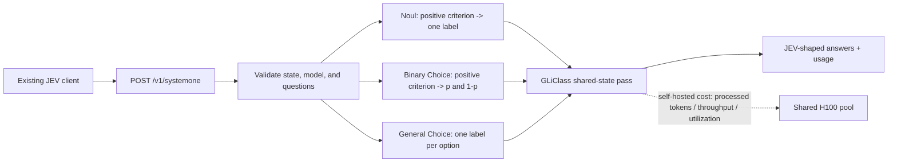

# Appendix: AskATT System1 API

**A JEV-shaped API implemented with GLiClass Modern Large v3**  
**Author: Mark Austin**  
**Date: September 20, 2026**

## Executive summary

`Askatt_system1_api` is a local, open-source compatibility layer for the TypeSafe System One `POST /v1/systemone` request pattern. It accepts a shared `state` plus a map of typed questions and returns JEV-shaped **Noul** and **Choice** answers. The implementation compiles the questions into GLiClass labels and scores them against the state in a shared forward pass.

This is an API-compatible experiment, not a reproduction of JEV. It does not claim TypeSafe's probability calibration, confidence semantics, training method, service limits, or proprietary neural architecture. The current TypeSafe documentation says JEV ingests the state once and evaluates questions in parallel; this implementation reaches the same external shared-state pattern through GLiClass's documented uni-encoder behavior.

On the locked 150-transcript test split (4,050 binary decisions), both API forms reproduced the raw GLiClass Modern Large result:

| API form | Accuracy | Precision | Recall | F1 | Exact transcript match |
|---|---:|---:|---:|---:|---:|
| Noul at 0.50 | 94.10% | 83.89% | 96.07% | 89.57% | 16.67% |
| Binary Choice | 94.10% | 83.89% | 96.07% | 89.57% | 16.67% |

The two forms are intentionally identical for a conventional binary Choice: GLiClass produces one positive probability `p`; Noul returns `p`, while Choice returns `{present: p, absent: 1-p}` and selects the larger value.

## Two decisions, not one

### For a data scientist or application team

Start with the hosted service or the local CPU implementation. Keep one request schema so experiments can move between implementations without changing application code. Use a held-out validation set to refine criteria and select per-label thresholds; do not buy or reserve a GPU before there is enough steady traffic to justify it.

A practical sequence is:

1. Establish quality with TypeSafe JEV and `Askatt_system1_api` on the same labeled examples.
2. Calibrate thresholds independently for each attribute and model.
3. Record state length, question count, request rate, burstiness, and p95 latency.
4. Choose the simplest option that satisfies quality, privacy, and latency requirements.

### For an enterprise platform team such as Ask AT&T

Treat this as a multi-tenant inference product rather than a model script. The platform needs tenant isolation, authorization, quotas, model/version pinning, request batching, autoscaling, observability, calibrated policy layers, fallbacks, and safe rollout controls.

The economic decision should separate **steady base load** from **bursts**:

- Keep exploratory and spiky workloads on usage-priced services.
- Consolidate compatible teams onto a shared self-hosted encoder pool; isolated team-by-team GPUs destroy utilization.
- Move stable base load to the pool only after measured demand makes the all-in self-hosted cost lower.
- Preserve hosted overflow for bursts, disaster recovery, long contexts, or labels that miss the local quality bar.
- Reserve capacity for interactive workloads. Driving a GPU to 100% is cost-efficient but increases queueing and p95/p99 latency.

At the report's reference workload of 6,000 state tokens and 25 questions, the H100 proxy estimates GLiClass at about **$0.051 per 1,000 states at 100% paid utilization**, versus about **$0.352 for JEV Noul**. The raw-inference crossover is therefore approximately `0.051 / 0.352 = 14.6%` utilization. This is not a migration trigger: redundancy, orchestration, engineering, idle failover capacity, and support make the real threshold higher. A sensible platform review starts when sustained utilization is roughly 25-40% and uses measured all-in costs and service-level objectives.

## Architecture



For up to 64 compiled labels, the service sends the state and all labels through one GLiClass pass. Above the configured label-batch size, it repeats the state once per label batch. The default service cap is 64 questions; a Choice with many options can therefore create more than 64 compiled labels and multiple passes.

## Compatibility boundary

The public TypeSafe contract currently requires a `model`, a string/object/array `state`, and a named question map. Noul returns a probability of yes. Choice returns a selected option, a probability distribution, and confidence. TypeSafe permits up to 255 Choice options.

| Capability | TypeSafe JEV | AskATT implementation |
|---|---|---|
| Endpoint | `POST /v1/systemone` | Same path |
| State | String, object, or array | Same accepted shapes, serialized to text |
| Noul | Yes | Yes |
| Choice | Yes, up to 255 options | Yes, up to 255 options |
| Score | Yes | Not implemented; returns 422 |
| Questions/request | Service-defined token limits | 64 question objects by default |
| Context | 64k total; state + longest question up to 32k | GLiClass 8,192-token model input; truncation exposed in a header |
| Confidence | JEV-defined | Normalized entropy; not JEV confidence |
| Usage | JEV billable tokens | Actual serialized GLiClass input tokens |
| Authentication | Bearer token | Optional bearer token via environment variable |
| Model selection | JEV alias/version selects model | Field is validated; local configured checkpoint answers |

Sources: [TypeSafe API reference](https://docs.typesafe.ai/api) and [TypeSafe models and limits](https://docs.typesafe.ai/models), accessed September 20, 2026.

## Request and response

```bash
curl http://127.0.0.1:8000/v1/systemone \
  -H 'Content-Type: application/json' \
  -d '{
    "model": "jev-latest",
    "state": "The caller disputes an unfamiliar fee on the bill.",
    "questions": {
      "unknown_charge": {
        "type": "noul",
        "instructions": "Is an unknown charge present?",
        "criteria": {"true": "Unknown charges on the bill"}
      },
      "department": {
        "type": "choice",
        "instructions": "Route the issue",
        "criteria": {
          "billing": "Billing, charges, and payments",
          "technical": "Internet or device technical failure",
          "sales": "New purchases or upgrades"
        }
      }
    }
  }'
```

```json
{
  "model": "askatt-gliclass-modern-large-v3.0",
  "answers": {
    "unknown_charge": {"type": "noul", "noul": 0.7835},
    "department": {
      "type": "choice",
      "choice": "billing",
      "probabilities": {"billing": 0.9890, "technical": 0.0067, "sales": 0.0043},
      "confidence": 0.932
    }
  },
  "usage": {"input_tokens": 61, "output_tokens": 0}
}
```

The response also exposes `X-AskATT-Inference-Ms`, `X-AskATT-Forward-Passes`, `X-AskATT-Compiled-Labels`, and `X-AskATT-Truncated` headers.

## Test results

The contract suite contains six deterministic API tests. A separate opt-in integration test loads the real GLiClass checkpoint and checks a mixed Noul/Choice request. All seven tests passed.

The full benchmark used the locked 150-row test split and 27 attributes per transcript:

| Measure | Noul | Binary Choice |
|---|---:|---:|
| Decisions | 4,050 | 4,050 |
| TP / FP / FN / TN | 1,026 / 197 / 42 / 2,785 | Same |
| Input tokens | 78,219 | 78,219 |
| Mean input tokens/state | 521.46 | 521.46 |
| Forward passes/state | 1.0 | 1.0 |
| Truncated rows | 0 | 0 |
| Local CPU wall time | 78.62 s | 83.10 s |
| Local CPU states/s | 1.91 | 1.81 |
| Local CPU decisions/s | 51.51 | 48.74 |

CPU timings are sequential local measurements after warm-up and exclude HTTP/network time. The small Noul/Choice difference is run-to-run overhead, not different model work.

Using the report's 170,331 processed-token/s H100 proxy and $5/GPU-hour assumption, the benchmark's 521.46 serialized tokens imply about **3.06 ms of saturated GPU resource time per state** and **$0.00425 per 1,000 states** at 100% utilization. These are capacity estimates, not measured request latency.

## Cost and latency formulas

For a self-hosted shared-state encoder:

```text
passes = ceil(compiled_labels / labels_per_pass)
processed_tokens ~= passes * state_tokens + serialized_label_tokens
resource_seconds/state = processed_tokens / saturated_tokens_per_second
cost/1,000 states = 1,000 * resource_seconds/state * gpu_dollars_per_hour
                    / (3,600 * paid_utilization)
```

For JEV's usage-priced interface:

```text
billable_tokens ~= state_tokens + sum(question_tokens) + request_overhead
cost/1,000 states = 1,000 * billable_tokens * dollars_per_input_token
```

Cost-efficient saturation is not the same as low latency. A rough service decomposition is:

```text
end_to_end_latency = queueing + preprocessing + model_service + postprocessing + network
```

The H100 estimate above models only `model_service`. Interactive platform deployments should load-test p50/p95/p99 latency and normally retain headroom rather than plan at continuous 100% utilization. Offline batch jobs can run closer to saturation.

## Run and reproduce

```bash
python3 -m venv --system-site-packages .venv
.venv/bin/pip install -r askatt_system1_api/requirements.txt
export ASKATT_GLICLASS_MODEL=models/gliclass-modern-large-v3.0
export ASKATT_DEVICE=cpu   # use cuda for an NVIDIA deployment
.venv/bin/python -m askatt_system1_api
```

```bash
.venv/bin/python -m pytest -q tests/test_askatt_system1_api.py
ASKATT_RUN_MODEL_TESTS=1 .venv/bin/python -m pytest -q tests/test_askatt_system1_model.py
.venv/bin/python scripts/benchmark_askatt_system1_api.py
```

Model weights are intentionally excluded from Git. See `askatt_system1_api/README.md` for installation and operational settings. Machine-readable benchmark output is in `results/askatt_system1_api_benchmark.json`.

## Recommended production next steps

1. Add Score only if an actual use case needs it; do not infer an ordinal score from an unvalidated Choice mapping.
2. Add versioned configuration for prompts, criteria, and per-label thresholds.
3. Benchmark CUDA with representative concurrency, batches, lengths, and question counts.
4. Add asynchronous dynamic batching and explicit overload/back-pressure behavior.
5. Add tenant-scoped authentication, audit logs, rate limits, and data-retention controls.
6. Run canary comparisons against pinned JEV versions and a labeled production shadow set.
7. Route steady base load locally and retain a hosted fallback until local quality and reliability are proven.

