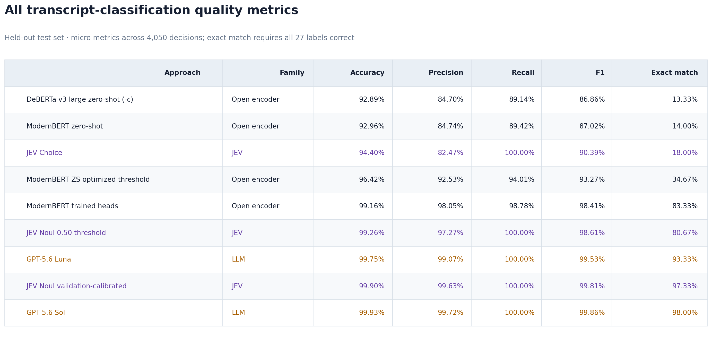
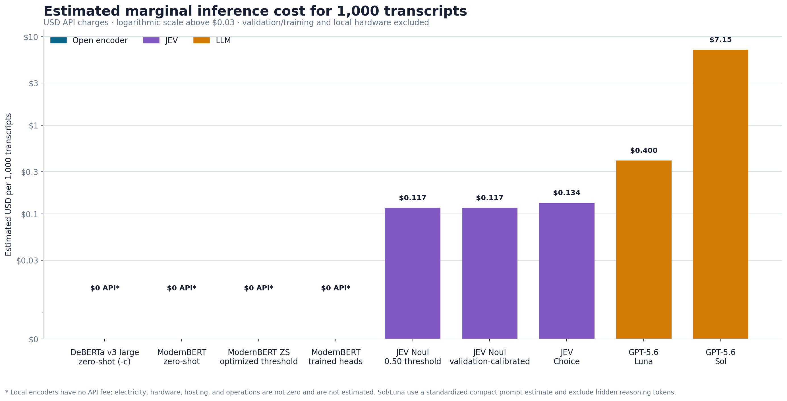

# System1 classifier comparisons for customer-care transcripts

**An independent synthetic benchmark of open encoders, TypeSafe.ai JEV, and GPT-5.6 Sol/Luna**  
**Mark Austin · September 19, 2026**

## Executive summary

This study compares nine transcript-classification configurations on the same 150-conversation locked test set. Each conversation has 27 independently labeled binary attributes, producing 4,050 held-out decisions. The broader dataset contains 1,000 synthetic customer-care conversations split into 700 training, 150 validation, and 150 test rows.

The highest measured quality came from GPT-5.6 Sol, with 99.93% accuracy and 99.86% micro F1. Validation-calibrated TypeSafe.ai JEV Noul was extremely close: 99.90% accuracy and 99.81% F1, with four errors rather than Sol's three. The trained ModernBERT system delivered the strongest fully local result at 99.16% accuracy and 98.41% F1.

The experiment also demonstrates that calibration matters. Selecting one validation-only threshold for each unchanged ModernBERT NLI question raised accuracy from 92.96% to 96.42% without changing model weights. Training 27 lightweight logistic heads on frozen ModernBERT embeddings produced a further substantial gain to 99.16%.

The benchmark is deliberately a smoke test. Its deterministic synthetic templates and explicit evidence make it useful for controlled comparisons, but unsuitable as a production-accuracy claim.

## Results

### Numerical results

| Approach | Accuracy | Precision | Recall | F1 | Exact match |
|---|---:|---:|---:|---:|---:|
| DeBERTa v3 large zero-shot (`-c`) | 92.89% | 84.70% | 89.14% | 86.86% | 13.33% |
| ModernBERT zero-shot | 92.96% | 84.74% | 89.42% | 87.02% | 14.00% |
| JEV Choice | 94.40% | 82.47% | 100.00% | 90.39% | 18.00% |
| ModernBERT zero-shot, optimized thresholds | 96.42% | 92.53% | 94.01% | 93.27% | 34.67% |
| ModernBERT trained heads | 99.16% | 98.05% | 98.78% | 98.41% | 83.33% |
| JEV Noul, 0.50 threshold | 99.26% | 97.27% | 100.00% | 98.61% | 80.67% |
| GPT-5.6 Luna | 99.75% | 99.07% | 100.00% | 99.53% | 93.33% |
| JEV Noul, validation-calibrated | 99.90% | 99.63% | 100.00% | 99.81% | 97.33% |
| GPT-5.6 Sol | 99.93% | 99.72% | 100.00% | 99.86% | 98.00% |

Accuracy, precision, recall, and F1 are micro metrics across the 4,050 binary decisions. Exact match is the percentage of transcripts for which all 27 labels were correct.

## Interpretation

### JEV Noul approached Sol quality at a much lower estimated API price

JEV Noul with validation-refined boundaries and validation-selected thresholds made four test errors: four false positives and no false negatives. Sol made three false positives and no false negatives. The difference is one decision out of 4,050, so this benchmark does not establish a meaningful quality separation between them.

The JEV result should not be described as purely zero-shot. Model weights were unchanged, but labeled validation examples influenced three ambiguous question definitions and two non-default probability thresholds. This is best understood as prompt and operating-point calibration.

### Training changed more than thresholds

The trained ModernBERT configuration was a frozen encoder plus 27 logistic heads. Each head learned 1,024 feature weights and an intercept from the 700 training transcripts; a threshold was then selected on validation. This is materially different from the optimized-threshold zero-shot variant, which left every NLI probability unchanged and learned only 27 scalar cutoffs.

Threshold calibration alone eliminated 140 of zero-shot ModernBERT's 285 test errors. The trained heads reduced the remaining error count from 145 to 34, showing that both calibration and supervised feature weighting contributed.

### DeBERTa did not improve this task

The commercially friendly DeBERTa-v3-large checkpoint was effectively tied with ModernBERT zero-shot but slightly lower on the main micro metrics. It made 288 errors versus ModernBERT's 285 and ran approximately 2.47 times slower on the same local CPU path. This does not imply ModernBERT is universally superior; it shows that substituting this encoder did not improve this particular taxonomy and prompt formulation.

### Choice versus Noul is not a controlled primitive comparison

The original JEV Choice run used a raw transcript string and generic present/absent criteria. The Noul run used structured speaker turns, detailed true/false boundaries, and validation refinement for three overlapping labels. Although a binary Choice argmax is mathematically equivalent to a 0.50 cutoff when both primitives expose the same probability, the API documentation does not guarantee identical internal scoring. More importantly, this experiment changed several factors simultaneously. A primitive-only A/B test remains future work.

## Estimated marginal cost

The cost chart estimates recurring marginal inference charges for 1,000 transcripts:

| Approach | Estimated API cost / 1,000 | Basis |
|---|---:|---|
| Local ModernBERT and DeBERTa variants | $0 API fee | Local compute; hardware and operations excluded |
| JEV Noul variants | $0.117 | 2,784.2 measured mean input tokens; output free |
| JEV Choice | $0.134 | 3,188.1 measured mean input tokens; output free |
| GPT-5.6 Luna | $0.400 | Standardized 728-input/212-output-token prompt |
| GPT-5.6 Sol | $7.152 | Standardized 728-input/212-output-token prompt |

JEV uses the published rate of $0.042 per million input tokens with free output. JEV Choice usage is measured over all 150 locked test requests; Noul usage is measured over a 10-transcript length-spanning sample. Sol and Luna use current standard API prices and a compact standardized classification prompt tokenized with `o200k_base`.

These are not total-cost-of-ownership figures. They exclude validation and training runs, hardware purchase or rental, electricity, service engineering, monitoring, and human review. Sol/Luna hidden reasoning tokens from the original Codex runs were unavailable, so the displayed LLM figures exclude them and may understate actual reasoning-model charges.

## Methodology

### Dataset

- 1,000 synthetic customer-care conversations.
- Alternating `[Agent]:` and `[Caller]:` turns.
- 27 binary attributes per conversation.
- Deterministic scenario-family-stratified split: 700 training, 150 validation, 150 test.
- The test partition was excluded from training, threshold selection, and prompt refinement.

### Open encoders

The zero-shot encoders treat each transcript as a premise and each attribute description as a hypothesis. Entailment probability is interpreted as attribute-presence probability. All transcript-attribute pairs are batched, but every attribute still receives an independent NLI score.

The trained ModernBERT variant mean-pools the frozen final hidden state into a 1,024-dimensional transcript vector, fits one class-balanced logistic regression per attribute on training data, and selects per-label F1 thresholds on validation.

### JEV

Choice and Noul questions were submitted in one request per transcript, with 27 questions sharing the state. The final Noul prompt represents the transcript as structured speaker messages and defines explicit positive and negative boundaries for every attribute.

### LLMs

Sol and Luna received truth-free transcript inputs and the 27-label output schema. Their results were validated for exactly 150 test IDs, 27 matching keys per row, and binary values. The test truth was joined only after predictions were complete.

## Limitations

1. Synthetic transcripts are easier and more regular than production calls.
2. Only 150 conversations are in the locked test set; one error changes accuracy by approximately 0.025 percentage points across all label decisions.
3. Attribute decisions within a transcript are correlated, so 4,050 labels are not equivalent to 4,050 independent samples.
4. The JEV Noul and Choice prompts differ beyond the API primitive.
5. Encoder timing was local CPU; JEV included hosted network time; Sol timing was an end-to-end Codex task; Luna inference timing was not reliably available.
6. Cost values use different evidence levels and are clearly labeled as measured or standardized estimates.
7. Thresholds and prompt boundaries may overfit the deterministic synthetic generator's ontology.

## Recommended next steps

- Collect a human-reviewed external test set of real or realistically paraphrased calls.
- Run the matched Choice-versus-Noul ablation with identical state representation and criteria.
- Add bootstrap confidence intervals at the conversation level.
- Measure production-path latency and cost with identical deployment hardware and request concurrency.
- Evaluate human-review gates and expected business cost, not just symmetric F1.

## Sources

- TypeSafe.ai, [API reference](https://docs.typesafe.ai/api).
- TypeSafe.ai, [Introducing System One Models and JEV](https://typesafe.ai/blog/introducing-system-one-models-and-jev).
- OpenAI, [GPT-5.6 Sol model and pricing](https://developers.openai.com/api/docs/models/gpt-5.6-sol).
- OpenAI, [GPT-5.6 Luna pricing update](https://openai.com/index/advancing-the-price-performance-frontier-with-gpt-5-6/).
- Hugging Face, [ModernBERT-large-zeroshot-v2.0](https://huggingface.co/MoritzLaurer/ModernBERT-large-zeroshot-v2.0).
- Hugging Face, [DeBERTa-v3-large-zeroshot-v2.0-c](https://huggingface.co/MoritzLaurer/deberta-v3-large-zeroshot-v2.0-c).

All benchmark outputs, threshold values, cost assumptions, and generation scripts are retained in this repository for auditability.
